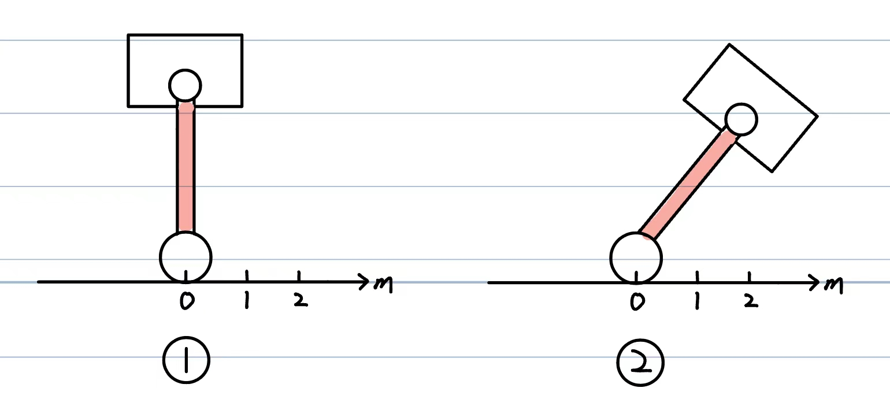
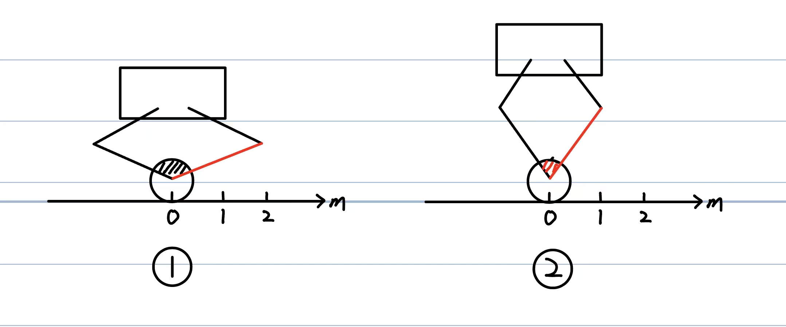
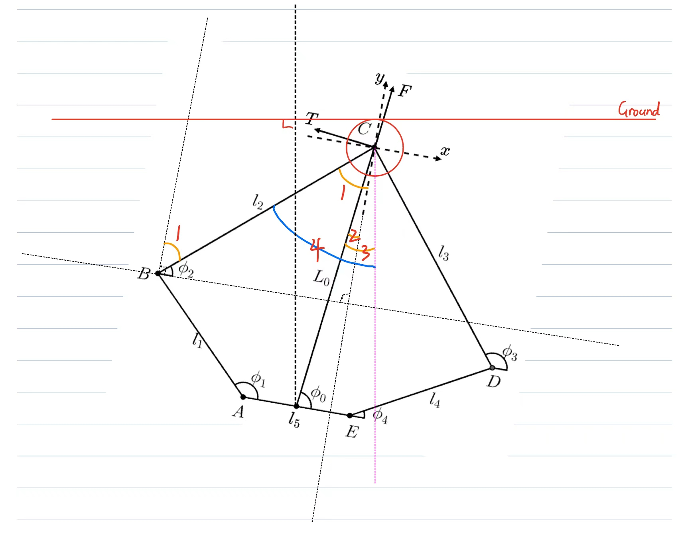

# 驱动轮电机在连杆转动时定转相对移动导致位移计算错误的分析

## 问题背景

在获取机器人的各个状态变量时，我们需要从各种硬件设备上读取原始数据并进行计算。对于机器人的位移状态变量，我们会使用驱动轮电机编码器（或速度传感器）的数据。通过检测编码器转过的角度，并乘以驱动轮半径，可以得出驱动轮经过的位移。然而，这种计算方式只有在驱动轮电机定子相对地面角度保持静止时才是准确的。在实际场景中，定子与地面的相对角度几乎一直在变化。

如上图的直腿模型所示，从状态一到状态二，驱动轮与地面没有发生相对移动，但定子却发生了变化。在这种情况下，驱动轮电机编码器的数值会改变，最终计算出的机器人位移和速度将不为零。然而，这与实际情况相矛盾，因为车体位移和速度应为零。

五连杆模型同样具有直腿模型的特性。除此之外，当五连杆模型的腿长发生变化时，也会导致此类问题。这也是某些学校的轮腿在腿长变化时会向前或向后产生小段位移的原因。

## 解决思路

了解问题的原因后，解决方案也变得明晰。我们需要利用驱动轮电机以外的设备进行校正。在直腿模型和五连杆模型中，定子都与红色连杆相连，红杆相对世界的转动角度便是我们希望得到的角度。对于直腿模型，这个值可以通过关节电机和机体的俯仰角计算得出；对于五连杆模型，原理相同，只是多了五连杆的角度运算。由于我们购买的驱动轮电机只有单一编码器，很难定义该角度的零点。因此，我希望获得红杆相对于世界的角速度，并在程序运行开始时对角速度进行积分，从而得到角度并进行补偿。

## 解决过程

接下来直接用五连杆模式举例说明。

​																		橙角为已知角：    ∠1 = 90° - phi2
​																										∠2 = vir_phi0
​								 																	   ∠3 = theta1
 																      蓝角为待求角：     ∠4 = ∠1 + ∠3 - ∠2

​											(phi1 ~ phi4，vir_phi0，thetal都为已知角，可参考我的MATLAB代码)

通关简单的角度关系即可求得定子相对地面旋转的角度。理论推导基本结束，应用到实车时，还需要注意各个角度的正方向（与你建模时的规定，电机自身特性，机械安装方式有关，上实车时请测量准确）。

得到角度后，将两个时刻测得角度做一个差分再除以采样间隔时间便可得知对应角速度。